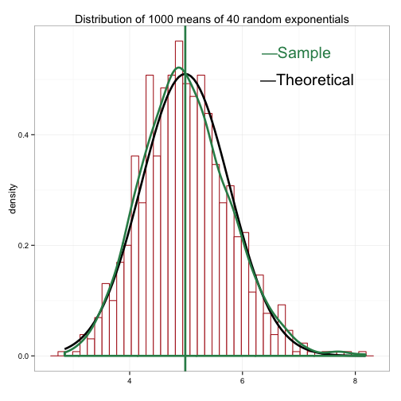
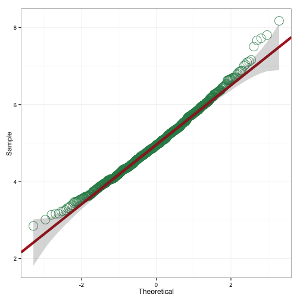

Statistical Inference Project 1
===============================
```EricRybicki```

## A Simulation Excercise

The exponential distribution can be simulated in R with ```rexp(n, lambda)```  where ```lambda``` is the rate parameter. The mean of exponential distribution is ```1/lambda``` and the standard deviation is also ```1/lambda```. For this simulation we will investigate the distribution of averages of 40 exponentials over a thousand observations, assuming the ```lambda = 0.2```

### Simulations
We start by doing a thousand simulated averages of 40 exponentials.

```r
      lambda <- 0.2
           n <- 1000
      s.size <- 40
  simulation <- matrix(rexp(n*s.size, rate=lambda), n, s.size)
sample.means <- rowMeans(simulation) 
```

### Sample Mean versus Theoretical Mean
We find that the sample mean is centered at 4.986 which is very close to the theoretical mean of 5.
 


```r
round(mean(sample.means), 3)
```

```
## [1] 4.986
```

```r
1/lambda
```

```
## [1] 5
```

### Sample Variance versus Theoretical Variance

We find the standard deviation of our sample

```r
sd(sample.means)
```

```
## [1] 0.7824004
```

And our predicted standard deviation

```r
(1/lambda)/sqrt(s.size)
```

```
## [1] 0.7905694
```

Next we can find the variance of our sample mean

```r
var(sample.means)
```

```
## [1] 0.6121505
```
Then we can find the theoretical variance of our distribution.

```r
((1/lambda)^2)/s.size
```

```
## [1] 0.625
```
This show us that our distribution of sample means, which is centered around the population mean of 5, has a variance of 0.612 which is in accord with the theoretical variance of 0.625 as predicted by the Central Limit Theorem. 

### Distribution

The Q-Q plot below shows two probability distributions where any point ``` (X,Y)``` denotes a data point from our sample distribution plotted against our theoretical distribution. The linearity suggests that normality is a good approximation.


```r
gg_qq(sample.means)
```

 

